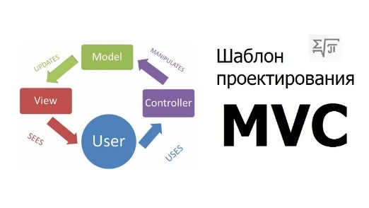
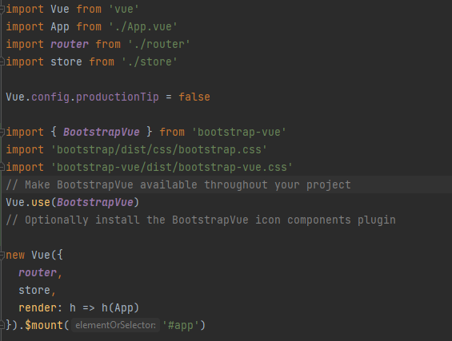
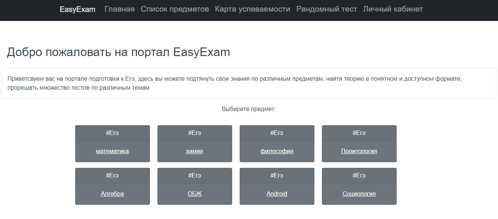

1. # Проектирование и разработка архитектуры приложения. 

В основе web-приложения EasyExam лежит архитектурный паттерн MVC (Рисунок 3), который долгое время остается популярным среди разработки программного обеспечения. Многие языки программирования используют этот паттерн концептуально одинаково, лишь с небольшими отклонениями. 

*Рисунок  SEQ Рисунок \\* ARABIC 3. MVC паттерн*

МVC представляет собой модель, представление, контроллер. Каждый компонент имеет свою роль. 

Модель представляет собой форму данных в которой хранятся все данные приложения. В нашем случае роль модели выполняет реляционная СУБД PostgreSQL. Документацию о PostgreSQL можно найти на официальном сайте [1].

Контроллер выступает в качестве некого посредника между моделью и представлением. Он получает запросы от представления, обрабатывает их, отправляя необходимые sql запросы в модель, и возвращая результат в виде JSON объектов. В нашем случае роль контроллера выполняет REST API написанный на Java при помощи Spring Framework. Информацию об sql можно прочитать на сайте [2].

Представление — это наш пользовательский интерфейс, это наш HTML и CSS. Представление отображает все изменения, которые делает пользователь, а также отправляет в контроллер запросы, читая данные, изменяя их и добавляя. В данной работе представление реализовано на JavaScript-фреймворке Vue.js, с использованием популярной интерфейсной библиотеки CSS - Bootstrap Vue. Информацию о Vue.js можно найти на официальном сайте с документаций [3]. Информацию о Bootstrap Vue можно найти на официальном сайте документации [4].
1. ## Разработка и реализация компонента View (интерфейс)

Представление реализовано в виде приложения на Vue.js, которое обрабатывает все действия со стороны пользователя, а также выводит на экран всю информацию, полученную с сервера. Для разработки был выбран Vue.js. потому что данный JavaScript Framework легко осваивается, и имеет прекрасные показатели производительности и эффективности. 

Для оформления интерфейса была выбрана популярная интерфейсная CSS библиотека - Bootstrap Vue, в ней есть готовые компоненты, которые можно использовать сразу в проекте после установки данной библиотеки. 

Задачи, которые необходимо выполнить при разработке фронтенда:

- Инициализировать проект в выбранном JavaScript Framework Vue.js.
- Установить все необходимые зависимости.
- Написать минимальную конфигурацию для запуска проекта. 
- Запрограммировать структуру приложения в виде компонентов 
- Сделать общую верстку внешнего вида каждого компонента 
- Реализовать привязку к модели данных приложения в архитектуре Flex
- Реализовать библиотеку запросов к Rest Api серверной части каждого ресурса. 
- Реализовать основную бизнес-логику приложения. (отображение и изменение данных)

Используемые инструменты разработки:

- IDE от JetBrains WebStorm. Информацию о работе и функционалу можно найти на официальном сайте [9].

Начало работы:

- Установка Node.js, как основной инструментарий для создания и разработки клиентских приложений.  
- Инициализация проекта с помощью vue cli, npm пакет, позволяющий быстро создавать новые проекты Vue.js. 
- Настройка конфигураций приложения: подключение Babel, Vuex, Router, CSS-preprocessors.

Основная настройка проекта vue происходит в файле main.js (Рисунок 17)

*Рисунок18. index.html*

*Рисунок17. main.js*
Одним из самых важных преимуществ Vue заключается в том, что мы можем разбивать все содержимое нашей страницы на компоненты, и использовать один и те же компоненты многократно, при сборке проекта все наши компоненты сливаются в один Html, который уже и отображается пользователю. Базовый html, в который вкладывается весь код проекта лежит в файле index.html. (Рисунок 18)

1. ### Модуль регистрации и авторизации 
*Рисунок 19. Авторизация*
При входе в систему первое что видит пользователь или администратор — это форма входа в систему. (Рисунок 19) 

При вводе данных пользователя, система проверяет по базе данных, является ли пользователь администратором. Система возвращает token, который храниться в localStorage, и который предоставляет соответствующий доступ к функционалу системы. Если авторизовался администратор системы, то ему будет доступен функционал редактирования всей базы данных, с помощью удобного и понятного в использовании графического интерфейса. 

Если же пользователь впервые в данной системе, то он может зарегистрироваться, нажав соответствующую ссылку. (Рисунок 20)

*Рисунок 20 Регистрация*

При регистрации отправляется post запрос на сервер и создается новый пользователь системы, который должен будет пройти авторизацию на странице входа и войти в систему под своим логином. 

1. ### Модуля взаимодействия администратора в системе. 

При входе администратора в систему, он получает token, который предоставит администратору системы расширенный функционал. 

Возможность редактировать всю базу данных, операции CRUD: 

- Create
- Read
- Update
- Delete

*Рисунок 22. Админка системы, таблица Task*

*Рисунок 21. Админка системы, таблица Lesson*

Админка системы выполнена в максимально простом и понятном формате. (Рисунок 21-22) 

Редактирование записей происходит при нажатии на соответствующую иконку, (Рисунок 23) удаление соответственно. При нажатии на кнопку «Добавить» администратор переходит на страницу где может создать новую запись. 

*Рисунок 23, редактирование записи*

При сохранении, с клиентской части отправляются запросы на сервер, откуда отправляются sql запросы в базу данных, для изменения, удаления, добавления.  
1. ### Модуль взаимодействия пользователя в системе
*Рисунок 24. Главное меню*
После входа и авторизации пользователя в системе выводится главная страница приложения с описанием, контактами, а также с возможностью выбрать предмет для изучения и решения задач. (Рисунок 24)

На главной странице выводится небольшое описание системы, а также карточки для выбора предмета. Данные о всех предметах достаются из базы данных и карточки генерируются автоматически, по количеству предметов. 

*Рисунок 25. Выбор темы*

Пользователь может выбрать предмет, нажав на необходимую карточку. При нажатии пользователь перейдет на страницу выбора темы для изучения или решения заданий. (Рисунок 25)

Здесь также как с предметами, карточки тем генерируются автоматически, по количеству тем данного предмета. Vue очень сильно помогает в генерации компонентов, за что он так и популярен. 

В каждой теме есть ссылка на теорию в виде документа, который пользователь может прочитать и детально изучить. 

Когда он будет готов приступить к заданиям, он может нажать на кнопку «решать задания» любой темы и приступить к решению заданий. (Рисунок 26)

*Рисунок 26. Решение заданий.*

 Когда пользователь решит задачу, он может вписать ответ в поле для проверки и проверить свой ответ. Все решения, правильные и неправильные, заносятся в базу данных для того, чтобы вести статистику решений для каждого пользователя. 

После решения многих тестов у пользователя складывается статистика решений по каждому предмету, по которой после он может понять, какие задания ему еще необходимо решать. 

PAGE   \\* MERGEFORMAT10

